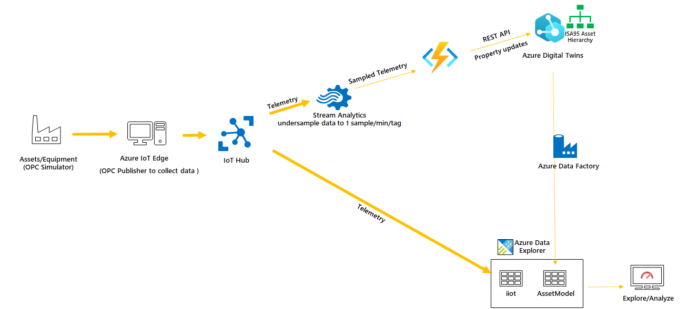

# Azure Digital Twins for Industrial IoT
###### 30 mins

This sample shows how to use Azure Digital Twins in an industrial environment.



<br>
---
<br>
## Pre-requisites

- An **Azure account with a valid subscription**. When using the default simulation configuration, 7 Virtual Machines (VMs) and 1 Virtual Network (VNet) will be deployed in your subscription for a daily cost of **$XXX**. For more details, see this [Azure Pricing Estimate](https://azure.com/e/4df47d47440b43e78076078496e2c3d1).

- **[Azure CLI](https://docs.microsoft.com/en-us/cli/azure/?view=azure-cli-latest) with the `azure-iot` CLI extension 0.10.6 or above** installed. We'll use a bash terminal from the [Azure Cloud Shell](https://docs.microsoft.com/en-us/azure/cloud-shell/overview) during install for which only a browser is needed.

  1. Open the [Azure Cloud Shell](https://shell.azure.com/) from your browser

  2. If you're using [Azure Cloud Shell](https://shell.azure.com/) for the first time, you'll be prompted to select a subscription to create a storage account and a Microsoft Azure Files share. Select Create storage to create a storage account for your Cloud Shell session information. This storage account is separate from resources used in this tutorial.

  3. Azure CLI extensions
     - Verify if required extensions is already installed with at least versions below:
     
       ```bash
      azure-iot    0.10.13
      datafactory  0.3.0
      kusto        0.3.0
       ```

     - Run followıng to get versions
       ```bash
       az --version
       ```

     - If not yet installed or lower version, run following commands to install/upgrade:
       ```bash
       az extension add --upgrade --name azure-iot
       az extension add --upgrade --name datafactory
       az extension add --upgrade --name kusto
       ```

  4. Verify that your are using the right subscription. You can also give subscription as a parameter to `./install.sh`

     ```bash
     az account show
     ```

<br>


## Installation

### Prepare source code

First we need to prepare the environment where we will run the script.

From the [Azure Cloud Shell](https://shell.azure.com/):

- Download the scripts:

    ```bash
    git clone git clone https://github.com/onderyildirim/adt4iiot.git
    ```

- Give execution permissions to these script:

    ```bash
    cd ./adt4iiot
    find  -name '*.sh' -print0 | xargs -0 chmod +x
    ```

- Unless you already have a SSH key pair, create one to connect to simulator and edge machines (To learn more about SSH key pairs, read [this documentation](https://docs.microsoft.com/azure/virtual-machines/linux/mac-create-ssh-keys)):

    ```bash
    ssh-keygen -m PEM -t rsa -b 4096
    ```
### Run installation script
- Run following to deploy Azure Digital Twins for Industrial IoT sample (~15 minutes):

    ```bash
    ./install.sh
    ```
    By default it will use first 5 letters of your user name as "prefix" and create all resources in to a resource group named "<prefix>-rg". You may also give any prefix you want from the command line parameters 
    ```bash
    ./install.sh prefix=adt4iiot
    ```
    The full syntax for install.sh is below
    ```bash
    Syntax: ./install.sh [-flag=value]

    List of optional flags:
    -h,--help              Print this help.
    -s,--subscription      Azure subscription ID to use to deploy resources. 
                               Default: use current subscription of Azure CLI.
    -l,--location          Azure region to deploy resources to. Default: eastus2.
    -p,--prefix            Prefix used for all new Azure Resource Groups created by this script. 
                               Default: first 5 characters of your user id.
    -v,--vmSize            Size of the Azure VMs to deploy. Default: Standard_B1ms.
    -k,--ssh-keypath       Path to the SSH public key that should be used to connect to simulator and edge VMs. 
                               Default: ~/.ssh/id_rsa.pub
    -u,--adminuser         Name of the admin user to be created in simulator and edge VMs. Default: azureuser
    ```
- Save the command given at the end of the script. It should be similar to below. If you forget to save the command or lose it, you can find it 
    ```bash
    az kusto data-connection iot-hub create --cluster-name <dataExplorerClusterName> --data-connection-name <iotHubName> --database-name <dataExplorerDBName> --resource-group <resourceGroupName> --consumer-group adxconsumer --data-format JSON --iot-hub-resource-id <iotHubResourceId> --location <azureDatacenterLocation> --event-system-properties "iothub-connection-device-id" --mapping-rule-name "iiot_raw_mapping" --shared-access-policy-name "iothubowner" --table-name "iiot_raw"
    ```


### Post install configuration
#### Create Data Explorer schema
- After the script finishes, goto Azure Data Explorer resource created in Azure portal, the ADX instance is named as "<prefix>adx" 
- Select "Query" in the left blade
- Make sure "iiotdb" database is selected on the left
- Run following Data Explorer script in query window to create database schema
    ```KQL
    .execute database script <|
    .create-merge table iiot_raw  (rawdata:dynamic)
    .alter-merge table iiot_raw policy retention softdelete = 0d
    .create-or-alter table iiot_raw ingestion json mapping 'iiot_raw_mapping' '[{"column":"rawdata","path":"$","datatype":"dynamic"}]'
    .create-merge table iiot (Timestamp: datetime, TagId: string, AssetId: string, Tag:string, Value: double, DeviceId:string)
    .create-or-alter function parseRawData()
    {
    iiot_raw
    | extend Timestamp =  todatetime(rawdata.Timestamp)
    | extend TagId = tostring(rawdata.TagId)
    | extend AssetId = tostring(rawdata.TagId)
    | extend Tag = tostring(rawdata.TagId)
    | extend Value = todouble(rawdata.Value)
    | extend DeviceId = tostring(rawdata.['iothub-connection-device-id'])
    | project Timestamp, TagId, AssetId, Tag, Value, DeviceId
    }
    .alter table iiot policy update @'[{"IsEnabled": true, "Source": "iiot_raw", "Query": "parseRawData()", "IsTransactional": true, "PropagateIngestionProperties": true}]'
    ```
- Run following in the same query windows to enable Azure Digital Twins plugin
    ```KQL
    .enable plugin azure_digital_twins_query_request
    ```

- Run the command given at the end of install script. It should be similar to below
    ```bash
    az kusto data-connection iot-hub create --cluster-name <dataExplorerClusterName> --data-connection-name <iotHubName> --database-name <dataExplorerDBName> --resource-group <resourceGroupName> --consumer-group adxconsumer --data-format JSON --iot-hub-resource-id <iotHubResourceId> --location <azureDatacenterLocation> --event-system-properties "iothub-connection-device-id" --mapping-rule-name "iiot_raw_mapping" --shared-access-policy-name "iothubowner" --table-name "iiot_raw"
    ```
#### Upload Azure Digital Twins graph
- Goto Azure Digital Twins instance in Azure portal and click on "Open Azure Digital Twins Explorer" in "Overview" blade.
- Download `twingraph.xlsx` file from github repo to your local drive. Direct link to file is below
      `https://github.com/onderyildirim/adt4iiot/blob/main/assetmodel/twingraph.xlsx`
- Click on "Twin Graph" and then "Import Graph"
- Select `twingraph.xlsx` file you downloaded and upload
- Click *Save* button upper right

#### [Optional] Activate Azure Data Factory trigger
Install script creates a trigger for data factory pipeline to transfer data from ADT into ADX. The trigger however is left disabled. If you would like it to run periodically, follow steps below 
- Go to Azure Data Factory instance (named <prefix>-syncassets) in Azure Portal
- Click on "Author & Monitor"
- Click on "Manage" on the toolbat at the left
- Click on "Triggers" under "Author"
- Click "DailyTrigger"
- Select "Yes" under "Activated"
- Optionally set "Recurence" to something other than default (24 hours)

#### [Optional] Set root twin id in Azure Data Factory
When we query data from Azure Digital Twins graph we need to set the root twin. If you imported the default `twingraph.xlsx` file, the root entity is the twin id `contoso`. If you would like to import your own twin structure, also remember to modify root object in query within the ADF pipeline: 
- Go to Azure Data Factory instance (named <prefix>-syncassets) in Azure Portal
- Click on "Author & Monitor"
- Click on "Author" on the toolbat at the left
- Click on "SyncAssetModel" under "Pipeline"
- Click "SyncAssetModelCommand" in the editor pane
- Select "Command" tab at the bottom pane
- Change **root twin id** to match the root twin of your hierarchy

.set-or-replace AssetModel <|
evaluate azure_digital_twins_query_request("https://<ADT instance>.digitaltwins.azure.net", "SELECT asset, unit, cell, area, site, enterprise FROM DIGITALTWINS enterprise JOIN site  RELATED enterprise.rel_has_sites JOIN area  RELATED site.rel_has_areas JOIN cell  RELATED area.rel_has_cells JOIN unit  RELATED cell.rel_has_units JOIN asset RELATED unit.rel_has_assets WHERE enterprise.$dtId = '**contoso**'")
   | project AssetId=tostring(asset.TagId), 
             DtId=tostring(asset.$dtId), 
             Asset=tostring(asset.Name), 
             AssetName=tostring(asset.AssetName), 
             YearDeployed=tostring(asset.YearDeployed), 
             AssetModel=tostring(asset.AssetModel), 
             Capacity=tostring(asset.Capacity), 
             Unit=tostring(unit.Name), 
             Cell=tostring(cell.Name), 
             Area=tostring(area.Name), 
             Site=tostring(site.Name), 
             Enterprise=tostring(enterprise.Name), 
             asset_data=asset, 
             unit_data=unit, 
             cell_data=cell, 
             area_data=area, 
             site_data=site, 
             enterprise_data=enterprise


## Contributing

The project welcomes contributions and suggestions.  Most contributions require you to agree to a
Contributor License Agreement (CLA) declaring that you have the right to, and actually do, grant us
the rights to use your contribution. For details, visit https://cla.opensource.microsoft.com.

When you submit a pull request, a CLA bot will automatically determine whether you need to provide
a CLA and decorate the PR appropriately (e.g., status check, comment). Simply follow the instructions
provided by the bot. You will only need to do this once across all repos using our CLA.

This project has adopted the [Microsoft Open Source Code of Conduct](https://opensource.microsoft.com/codeofconduct/).
For more information see the [Code of Conduct FAQ](https://opensource.microsoft.com/codeofconduct/faq/) or
contact [opencode@microsoft.com](mailto:opencode@microsoft.com) with any additional questions or comments.
